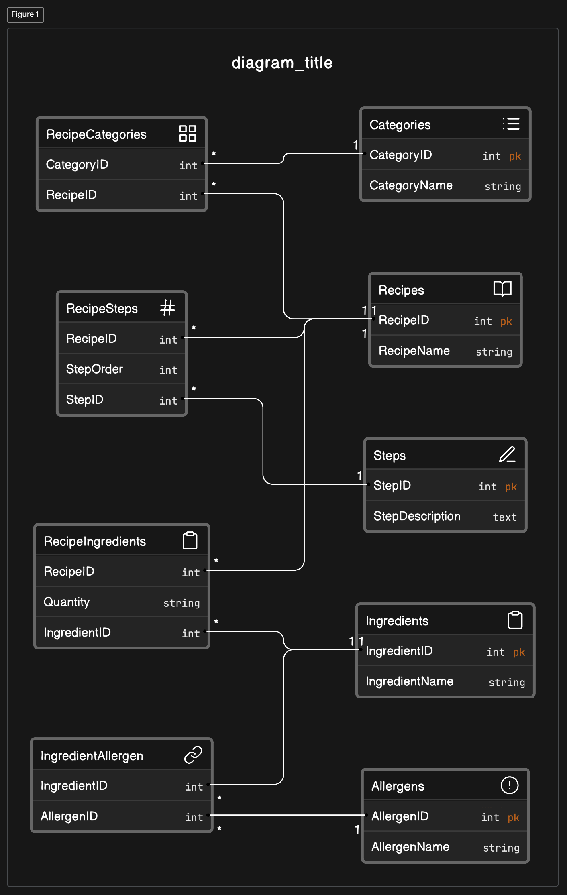

# Normalization Analysis

1. **First Normal Form (1NF):**

   - All tables appear to be in 1NF since they have a primary key and all attributes contain atomic values.

2. **Second Normal Form (2NF):**

   - The database seems to be in 2NF. There are no partial dependencies of any non-primary attribute on a part of the primary key since all primary keys are single columns.

3. **Third Normal Form (3NF):**
   - The database seems to be in 3NF. There are no transitive dependencies.

## Extra TABLES ADDITION

```sql
CREATE TABLE
    IF NOT EXISTS Allergens (
        AllergenID int NOT NULL AUTO_INCREMENT,
        AllergenName varchar(255),
        PRIMARY KEY (AllergenID)
    );

CREATE TABLE
    IF NOT EXISTS IngredientAllergen (
        IngredientID int,
        AllergenID int,
        FOREIGN KEY (IngredientID) REFERENCES Ingredients(IngredientID),
        FOREIGN KEY (AllergenID) REFERENCES Allergens(AllergenID)
    );

-- Modify table RecipeStep

CREATE TABLE
    IF NOT EXISTS RecipeStep (
        RecipeID int,
        StepID int,
        StepOrder int,
        FOREIGN KEY (RecipeID) REFERENCES Recipes(RecipeID),
        FOREIGN KEY (StepID) REFERENCES Steps(StepID)
    );
```



## Entities and Attributes:

1. **Recipe**
   - Attributes: `RecipeID` (PK), `RecipeName`, `Description`, `CookingTime`, `ServingSize`
2. **Ingredient**
   - Attributes: `IngredientID` (PK), `IngredientName`, `Allergens`, `AverageCost`
3. **Category**
   - Attributes: `CategoryID` (PK), `CategoryName`
4. **Step**
   - Attributes: `StepID` (PK), `StepDescription`
5. **Allergen** (if implementing the suggested normalization)
   - Attributes: `AllergenID` (PK), `AllergenName`

## Relationships:

1. **Recipe - Ingredient**
   - Many-to-Many: A recipe can contain many ingredients, and an ingredient can be in many recipes.
   - Associative Entity: `RecipeIngredient` with attributes `RecipeID` (FK), `IngredientID` (FK), `Quantity`
2. **Recipe - Category**
   - Many-to-Many: A recipe can belong to many categories, and a category can include many recipes.
   - Associative Entity: `RecipeCategory` with attributes `RecipeID` (FK), `CategoryID` (FK)
3. **Recipe - Step**
   - One-to-Many: A recipe has multiple steps.
   - Associative Entity: `RecipeStep` with attributes `RecipeID` (FK), `StepID` (FK), `StepOrder` (if implementing the suggested normalization)
4. **Ingredient - Allergen** (if implementing the suggested normalization)
   - Many-to-Many: An ingredient can have multiple allergens, and an allergen can be associated with multiple ingredients.
   - Associative Entity: `IngredientAllergen` with attributes `IngredientID` (FK), `AllergenID` (FK)

## Challenges in Scaling the Database

1. **Data Duplication:** If the database grows with thousands of recipes, there could be a lot of duplicated data, especially in ingredients and steps.
2. **Performance:** Retrieving information might become slower as the database grows, requiring optimized queries and indexes.
3. **Complex Queries:** As the number of associative tables increases, queries might become more complex.
4. **Data Integrity:** Ensuring data consistency and integrity might become more challenging with a larger dataset.
5. **Storage Requirements:** A larger database will require more storage space and resources to manage effectively.
